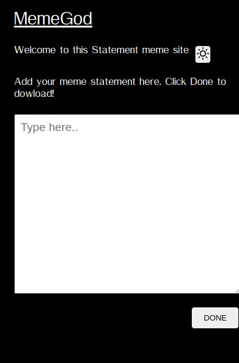
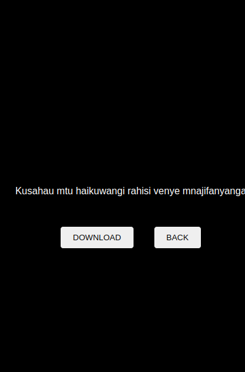
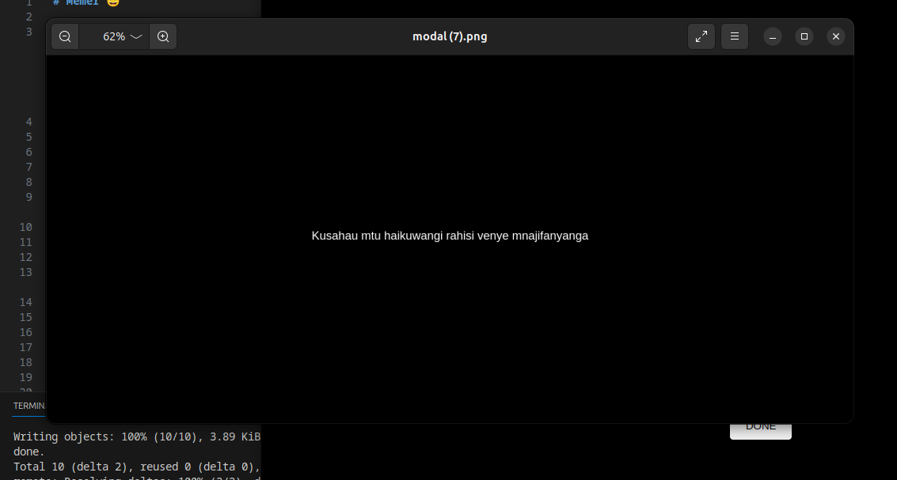

# Memer 😄

Memer is a web application that lets you unleash your creativity and create hilarious meme statements. 🎉 It provides an easy-to-use interface where you can enter your text and download the meme as an image. 😁 Memer also offers a customizable theme with light and dark modes. 🌞🌚

## Features 🚀

- Enter your funniest meme statements and phrases 📝
- Download your creations as shareable images 🖼️
- Switch between a light and dark theme to match your mood 😎🌙

## Demo 🌐

You can check out the live demo of Memer [here](https://example.com). 🎈

## Screenshots 📷

## Installation ⚙️

1. Clone the repository: `git clone https://github.com/cindykandie/memer`
2. Navigate to the project directory: `cd memer`
3. Open `index.html` in your favorite web browser.

## Usage 🎯

1. Enter your wittiest meme statements in the provided textarea. 😄
2. Click the "Done" button to generate your hilarious meme. 🚀
3. If the textarea is not empty, a dialog box will pop up asking for confirmation. 📢
4. Click "Yes" if you're ready to witness the power of your meme creation! 😎
5. Click "No" if you want to go back and make changes to your meme statement. 🔄
6. To match your meme-making mood, click the theme button (sun/moon icon) in the header section to toggle between the light and dark themes. ☀️🌒

## License 📜

This project is licensed under the [MIT License](LICENSE). Feel free to use and modify the code for your own meme-making adventures! 😄

## Acknowledgements 🙌

- [Open Source License](https://opensource.org/licenses/MIT) 📝
- [Feather Icons](https://feathericons.com/) for the awesome sun and moon icons ☀️🌙

## Got a Joke? 😄

Why did the computer go to art school? 🎨
Because it wanted to become a graphic designer! 😄🖥️

Why don't scientists trust atoms? ⚛️
Because they make up everything! 🤣

Have fun memeing and enjoy spreading laughter with Memer! 😄🎉🚀